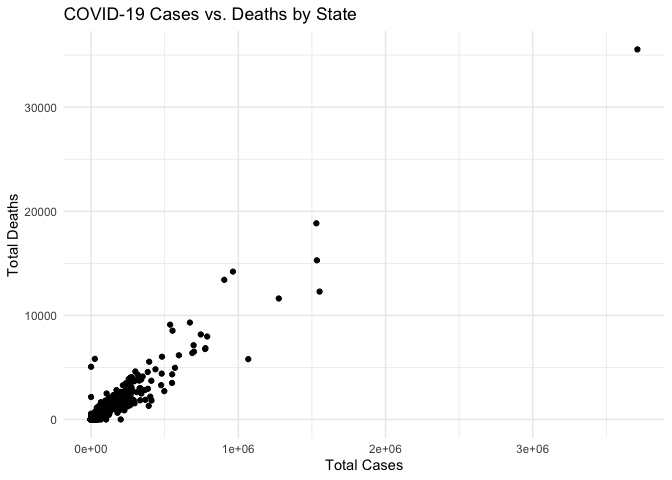

Testing the Linear Relationship Between Cases and Deaths
================
Benji Edwards
2024-03-04

Research Question: Are cases an indicator for COVID deaths? If so, how
strong is this relationship?

# Import

Load R packages and data from Johns Hopkins COVID-19 repository. This
data includes case reports from January 21, 2020 to March 9, 2023.

``` r
# Load in R packages and data
library(tidyverse)
```

    ## ── Attaching core tidyverse packages ──────────────────────── tidyverse 2.0.0 ──
    ## ✔ dplyr     1.1.4     ✔ readr     2.1.5
    ## ✔ forcats   1.0.0     ✔ stringr   1.5.1
    ## ✔ ggplot2   3.5.0     ✔ tibble    3.2.1
    ## ✔ lubridate 1.9.3     ✔ tidyr     1.3.1
    ## ✔ purrr     1.0.2     
    ## ── Conflicts ────────────────────────────────────────── tidyverse_conflicts() ──
    ## ✖ dplyr::filter() masks stats::filter()
    ## ✖ dplyr::lag()    masks stats::lag()
    ## ℹ Use the conflicted package (<http://conflicted.r-lib.org/>) to force all conflicts to become errors

``` r
us_covid_cases <- read_csv("https://raw.githubusercontent.com/CSSEGISandData/COVID-19/master/csse_covid_19_data/csse_covid_19_time_series/time_series_covid19_confirmed_US.csv")
```

    ## Rows: 3342 Columns: 1154
    ## ── Column specification ────────────────────────────────────────────────────────
    ## Delimiter: ","
    ## chr    (6): iso2, iso3, Admin2, Province_State, Country_Region, Combined_Key
    ## dbl (1148): UID, code3, FIPS, Lat, Long_, 1/22/20, 1/23/20, 1/24/20, 1/25/20...
    ## 
    ## ℹ Use `spec()` to retrieve the full column specification for this data.
    ## ℹ Specify the column types or set `show_col_types = FALSE` to quiet this message.

``` r
us_covid_deaths <- read_csv("https://raw.githubusercontent.com/CSSEGISandData/COVID-19/master/csse_covid_19_data/csse_covid_19_time_series/time_series_covid19_deaths_US.csv")
```

    ## Rows: 3342 Columns: 1155
    ## ── Column specification ────────────────────────────────────────────────────────
    ## Delimiter: ","
    ## chr    (6): iso2, iso3, Admin2, Province_State, Country_Region, Combined_Key
    ## dbl (1149): UID, code3, FIPS, Lat, Long_, Population, 1/22/20, 1/23/20, 1/24...
    ## 
    ## ℹ Use `spec()` to retrieve the full column specification for this data.
    ## ℹ Specify the column types or set `show_col_types = FALSE` to quiet this message.

# Inspect

Let’s take a look at the data that we’ve imported.

``` r
# US COVID cases
nrow(us_covid_cases)
```

    ## [1] 3342

``` r
head(us_covid_cases)
```

    ## # A tibble: 6 × 1,154
    ##        UID iso2  iso3  code3  FIPS Admin2  Province_State Country_Region   Lat
    ##      <dbl> <chr> <chr> <dbl> <dbl> <chr>   <chr>          <chr>          <dbl>
    ## 1 84001001 US    USA     840  1001 Autauga Alabama        US              32.5
    ## 2 84001003 US    USA     840  1003 Baldwin Alabama        US              30.7
    ## 3 84001005 US    USA     840  1005 Barbour Alabama        US              31.9
    ## 4 84001007 US    USA     840  1007 Bibb    Alabama        US              33.0
    ## 5 84001009 US    USA     840  1009 Blount  Alabama        US              34.0
    ## 6 84001011 US    USA     840  1011 Bullock Alabama        US              32.1
    ## # ℹ 1,145 more variables: Long_ <dbl>, Combined_Key <chr>, `1/22/20` <dbl>,
    ## #   `1/23/20` <dbl>, `1/24/20` <dbl>, `1/25/20` <dbl>, `1/26/20` <dbl>,
    ## #   `1/27/20` <dbl>, `1/28/20` <dbl>, `1/29/20` <dbl>, `1/30/20` <dbl>,
    ## #   `1/31/20` <dbl>, `2/1/20` <dbl>, `2/2/20` <dbl>, `2/3/20` <dbl>,
    ## #   `2/4/20` <dbl>, `2/5/20` <dbl>, `2/6/20` <dbl>, `2/7/20` <dbl>,
    ## #   `2/8/20` <dbl>, `2/9/20` <dbl>, `2/10/20` <dbl>, `2/11/20` <dbl>,
    ## #   `2/12/20` <dbl>, `2/13/20` <dbl>, `2/14/20` <dbl>, `2/15/20` <dbl>, …

``` r
tail(us_covid_cases)
```

    ## # A tibble: 6 × 1,154
    ##        UID iso2  iso3  code3  FIPS Admin2    Province_State Country_Region   Lat
    ##      <dbl> <chr> <chr> <dbl> <dbl> <chr>     <chr>          <chr>          <dbl>
    ## 1 84056037 US    USA     840 56037 Sweetwat… Wyoming        US              41.7
    ## 2 84056039 US    USA     840 56039 Teton     Wyoming        US              43.9
    ## 3 84056041 US    USA     840 56041 Uinta     Wyoming        US              41.3
    ## 4 84090056 US    USA     840 90056 Unassign… Wyoming        US               0  
    ## 5 84056043 US    USA     840 56043 Washakie  Wyoming        US              43.9
    ## 6 84056045 US    USA     840 56045 Weston    Wyoming        US              43.8
    ## # ℹ 1,145 more variables: Long_ <dbl>, Combined_Key <chr>, `1/22/20` <dbl>,
    ## #   `1/23/20` <dbl>, `1/24/20` <dbl>, `1/25/20` <dbl>, `1/26/20` <dbl>,
    ## #   `1/27/20` <dbl>, `1/28/20` <dbl>, `1/29/20` <dbl>, `1/30/20` <dbl>,
    ## #   `1/31/20` <dbl>, `2/1/20` <dbl>, `2/2/20` <dbl>, `2/3/20` <dbl>,
    ## #   `2/4/20` <dbl>, `2/5/20` <dbl>, `2/6/20` <dbl>, `2/7/20` <dbl>,
    ## #   `2/8/20` <dbl>, `2/9/20` <dbl>, `2/10/20` <dbl>, `2/11/20` <dbl>,
    ## #   `2/12/20` <dbl>, `2/13/20` <dbl>, `2/14/20` <dbl>, `2/15/20` <dbl>, …

``` r
# US COVID deaths
nrow(us_covid_deaths)
```

    ## [1] 3342

``` r
head(us_covid_deaths)
```

    ## # A tibble: 6 × 1,155
    ##        UID iso2  iso3  code3  FIPS Admin2  Province_State Country_Region   Lat
    ##      <dbl> <chr> <chr> <dbl> <dbl> <chr>   <chr>          <chr>          <dbl>
    ## 1 84001001 US    USA     840  1001 Autauga Alabama        US              32.5
    ## 2 84001003 US    USA     840  1003 Baldwin Alabama        US              30.7
    ## 3 84001005 US    USA     840  1005 Barbour Alabama        US              31.9
    ## 4 84001007 US    USA     840  1007 Bibb    Alabama        US              33.0
    ## 5 84001009 US    USA     840  1009 Blount  Alabama        US              34.0
    ## 6 84001011 US    USA     840  1011 Bullock Alabama        US              32.1
    ## # ℹ 1,146 more variables: Long_ <dbl>, Combined_Key <chr>, Population <dbl>,
    ## #   `1/22/20` <dbl>, `1/23/20` <dbl>, `1/24/20` <dbl>, `1/25/20` <dbl>,
    ## #   `1/26/20` <dbl>, `1/27/20` <dbl>, `1/28/20` <dbl>, `1/29/20` <dbl>,
    ## #   `1/30/20` <dbl>, `1/31/20` <dbl>, `2/1/20` <dbl>, `2/2/20` <dbl>,
    ## #   `2/3/20` <dbl>, `2/4/20` <dbl>, `2/5/20` <dbl>, `2/6/20` <dbl>,
    ## #   `2/7/20` <dbl>, `2/8/20` <dbl>, `2/9/20` <dbl>, `2/10/20` <dbl>,
    ## #   `2/11/20` <dbl>, `2/12/20` <dbl>, `2/13/20` <dbl>, `2/14/20` <dbl>, …

``` r
tail(us_covid_deaths)
```

    ## # A tibble: 6 × 1,155
    ##        UID iso2  iso3  code3  FIPS Admin2    Province_State Country_Region   Lat
    ##      <dbl> <chr> <chr> <dbl> <dbl> <chr>     <chr>          <chr>          <dbl>
    ## 1 84056037 US    USA     840 56037 Sweetwat… Wyoming        US              41.7
    ## 2 84056039 US    USA     840 56039 Teton     Wyoming        US              43.9
    ## 3 84056041 US    USA     840 56041 Uinta     Wyoming        US              41.3
    ## 4 84090056 US    USA     840 90056 Unassign… Wyoming        US               0  
    ## 5 84056043 US    USA     840 56043 Washakie  Wyoming        US              43.9
    ## 6 84056045 US    USA     840 56045 Weston    Wyoming        US              43.8
    ## # ℹ 1,146 more variables: Long_ <dbl>, Combined_Key <chr>, Population <dbl>,
    ## #   `1/22/20` <dbl>, `1/23/20` <dbl>, `1/24/20` <dbl>, `1/25/20` <dbl>,
    ## #   `1/26/20` <dbl>, `1/27/20` <dbl>, `1/28/20` <dbl>, `1/29/20` <dbl>,
    ## #   `1/30/20` <dbl>, `1/31/20` <dbl>, `2/1/20` <dbl>, `2/2/20` <dbl>,
    ## #   `2/3/20` <dbl>, `2/4/20` <dbl>, `2/5/20` <dbl>, `2/6/20` <dbl>,
    ## #   `2/7/20` <dbl>, `2/8/20` <dbl>, `2/9/20` <dbl>, `2/10/20` <dbl>,
    ## #   `2/11/20` <dbl>, `2/12/20` <dbl>, `2/13/20` <dbl>, `2/14/20` <dbl>, …

# Tidy

Now let’s tidy the data so it can be analyzed. I want to summarize all
of the cases and deaths by county. Upon further inspection of my data,
it looks like we’ve got a running sum of cases and deaths by the date
columns. Keeping the last date (“3/9/23”) column will give me my totals
for each county.

``` r
# Let's start by keeping only the columns we're interested in.
us_cases_clean <- us_covid_cases %>%
  select(c('Admin2', 'Province_State', '3/9/23'))

# Rename "Admin2" and "3/9/23"
us_cases_clean <- rename(us_cases_clean, County = Admin2, Cases = '3/9/23')

# Inspect data
head(us_cases_clean)
```

    ## # A tibble: 6 × 3
    ##   County  Province_State Cases
    ##   <chr>   <chr>          <dbl>
    ## 1 Autauga Alabama        19790
    ## 2 Baldwin Alabama        69860
    ## 3 Barbour Alabama         7485
    ## 4 Bibb    Alabama         8091
    ## 5 Blount  Alabama        18704
    ## 6 Bullock Alabama         3030

Let’s repeat this for ‘us_covid_deaths’

``` r
# Remove unwanted columns
us_deaths_clean <- us_covid_deaths %>%
  select(c('Admin2', 'Province_State', '3/9/23'))

# Rename "Admin2" and "3/9/23"
us_deaths_clean <- rename(us_deaths_clean, County = Admin2, Deaths = '3/9/23')

# Inspect data
head(us_deaths_clean)
```

    ## # A tibble: 6 × 3
    ##   County  Province_State Deaths
    ##   <chr>   <chr>           <dbl>
    ## 1 Autauga Alabama           232
    ## 2 Baldwin Alabama           727
    ## 3 Barbour Alabama           103
    ## 4 Bibb    Alabama           109
    ## 5 Blount  Alabama           261
    ## 6 Bullock Alabama            54

# Transform, Visualize & Model

Excellent! It looks like our two dataframes have the same number of
rows. Looks like we’re ready to merge them together.

``` r
# Merge deaths and cases by county and state
covid_data <- merge(us_cases_clean, us_deaths_clean, by = c("County", "Province_State"))

# Inspect data
head(covid_data)
```

    ##      County Province_State  Cases Deaths
    ## 1 Abbeville South Carolina   7826     78
    ## 2    Acadia      Louisiana  18944    311
    ## 3  Accomack       Virginia   9119    119
    ## 4       Ada          Idaho 160373   1139
    ## 5     Adair           Iowa   1805     52
    ## 6     Adair       Kentucky   7849    115

``` r
#check for nulls
sum(is.na(covid_data))
```

    ## [1] 6

``` r
# Drop nulls
covid_data <- na.omit(covid_data)
```

Now that I have my combined data, let’s visualize it.

``` r
ggplot(covid_data, aes(x=Cases, y=Deaths)) +
  geom_point() +
  labs(title="COVID-19 Cases vs. Deaths by State",
       x="Total Cases",
       y="Total Deaths") +
  theme_minimal()
```

<!-- -->

It seems like there is clearly a linear relationship. Let’s test using
linear regression.

``` r
model <- lm(Deaths ~ Cases, data=covid_data)

# Summarize the linear model
summary(model)
```

    ## 
    ## Call:
    ## lm(formula = Deaths ~ Cases, data = covid_data)
    ## 
    ## Residuals:
    ##     Min      1Q  Median      3Q     Max 
    ## -4703.6   -31.8   -13.2    23.4  5539.6 
    ## 
    ## Coefficients:
    ##              Estimate Std. Error t value Pr(>|t|)    
    ## (Intercept) 3.185e+01  5.557e+00   5.731 1.09e-08 ***
    ## Cases       9.807e-03  4.923e-05 199.218  < 2e-16 ***
    ## ---
    ## Signif. codes:  0 '***' 0.001 '**' 0.01 '*' 0.05 '.' 0.1 ' ' 1
    ## 
    ## Residual standard error: 308.6 on 3334 degrees of freedom
    ## Multiple R-squared:  0.9225, Adjusted R-squared:  0.9225 
    ## F-statistic: 3.969e+04 on 1 and 3334 DF,  p-value: < 2.2e-16

Based on our extremely low p-value and high r-square, our linear model
suggests a strong relationship with a good model fit. Let’s place our
line on the scatter plot.

``` r
ggplot(covid_data, aes(x=Cases, y=Deaths)) +
  geom_point() +
  geom_smooth(method="lm", col="red") +
  labs(title="Linear Model Fit: COVID-19 Cases vs. Deaths by State",
       x="Total Cases",
       y="Total Deaths") +
  theme_minimal()
```

    ## `geom_smooth()` using formula = 'y ~ x'

<!-- -->

# Communicate Results

As expected, there is a strong relationship between cases and deaths.
The p-value was less than 2.2e-16 (extremely small), indicating a
significant relationship between the two. Additionally, the r-squared
was 0.9225 (very high), which indicates that the linear regression model
is a good fit for the data.

In future analysis, we could investigate whether the state was an
indicator of COVID deaths. From there, we could look at state with the
highest and lowest mortality and research their COVID policies to infer
which policies produced the safest, or least safe, environment.

Bias for this data may come from how COVID deaths are defined. In the
hospital setting, many people are there for other life threatening
emergencies, and may have been exposed to COVID before death. If their
leading of death was something other than COVID, they still may have
been characterized as a COVID death since COVID was a contributing
factor. Perhaps some healthcare settings had biases on whether to
include COVID, or not, as a contributing cause of death.
